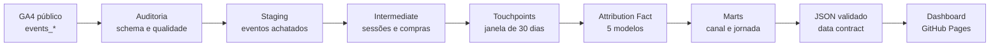

# GA4 Multi-Touch Attribution Engineering

Pipeline de engenharia analítica que transforma **4,3 milhões de eventos brutos do GA4** em jornadas de compra auditáveis, aplica cinco modelos de atribuição e publica os resultados em uma apresentação executiva interativa.

[](https://cloud.google.com/bigquery)
[](https://alexandresantosrodrigues.github.io/ga4-multi-touch-attribution/)
[](#como-reproduzir)
[](#qualidade-e-reconciliação)

> **[Abrir apresentação executiva](https://alexandresantosrodrigues.github.io/ga4-multi-touch-attribution/#slide-1)**

## Problema de negócio

O último canal antes da compra não necessariamente criou a demanda. Usar apenas Last-Click para avaliar marketing pode supervalorizar canais de fechamento e reduzir investimento em canais que iniciam ou assistem a jornada.

Este projeto responde:

- como reconstruir jornadas confiáveis a partir do esquema aninhado e incompleto do GA4;
- quanto crédito cada canal recebe em diferentes regras de atribuição;
- quais decisões mudam quando First-Click, Last-Click, Linear, Time-Decay e Position-Based são comparados;
- como assegurar que conversões e receita não sejam criadas ou perdidas durante o processamento.

## Principais resultados

| Indicador | Resultado |
|---|---:|
| Eventos brutos processados | 4.295.584 |
| Sessões identificadas | 360.129 |
| Eventos de compra brutos | 5.692 |
| Compras canônicas | 5.372 |
| Linhas duplicadas removidas | 320 |
| Receita canônica | 340.647 |
| Touchpoints | 11.234 |
| Jornadas multi-touch | 2.505 (46,63%) |
| Jornadas multicanal | 1.916 (35,67%) |
| Touchpoints médios | 2,09 |
| Duração média da jornada | 3,42 dias |
| P90 da duração | 14 dias |
| Autorreferências tratadas | 112.878 sessões |

### O que muda entre modelos

| Canal | First-Click | Last-Click | Linear | Time-Decay | Position-Based |
|---|---:|---:|---:|---:|---:|
| google / organic | 2.126,00 | 1.811,00 | 1.902,50 | 1.906,98 | 1.940,16 |
| (unattributed) / (not available) | 1.072,00 | 1.452,00 | 1.390,96 | 1.376,55 | 1.317,54 |
| &lt;Other&gt; / referral | 1.164,00 | 1.143,00 | 1.108,52 | 1.137,86 | 1.133,14 |
| (direct) / (none) | 394,00 | 363,00 | 370,78 | 361,83 | 375,49 |
| (data deleted) / (data deleted) | 82,00 | 237,00 | 174,99 | 181,27 | 166,71 |
| google / cpc | 81,00 | 50,00 | 60,60 | 58,16 | 63,35 |

Google / CPC recebe **62% mais conversões no First-Click do que no Last-Click**. Isso não prova causalidade, mas demonstra como uma única regra pode ocultar o papel de descoberta do canal.

## Arquitetura



O BigQuery permanece como núcleo do processamento. As camadas analíticas são implementadas como views para compatibilidade com o BigQuery Sandbox. O dashboard é estático, não expõe credenciais e consome apenas um JSON agregado.

## Modelagem

### Grão das principais entidades

| Objeto | Grão |
|---|---|
| `stg_ga4_events` | um evento GA4 |
| `int_sessions` | uma sessão canônica |
| `int_purchases` | uma compra canônica |
| `int_touchpoints` | uma sessão elegível por compra |
| `fct_attribution` | modelo × compra × touchpoint |
| `mart_channel_performance` | modelo × canal |
| `mart_model_comparison` | canal |
| `mart_journey_analysis` | compra |

### Regras de negócio

- **Janela de atribuição:** 30 dias anteriores à compra.
- **Sessão da conversão:** sempre preservada, inclusive em compras repetidas.
- **Autorreferências:** domínios internos da Google Merchandise Store não recebem crédito.
- **Canal da sessão:** derivado de `event_params`, pois a amostra histórica não possui `collected_traffic_source`.
- **Compra válida:** transações com ID usam `user_pseudo_id + transaction_id`; IDs ausentes ou placeholders usam `user_pseudo_id + event_timestamp`.
- **Receita:** compras sem receita permanecem na contagem de conversões, mas não adicionam receita.

## Cinco modelos de atribuição

| Modelo | Distribuição do crédito | Uso interpretativo |
|---|---|---|
| First-Click | 100% para o primeiro touchpoint | descoberta |
| Last-Click | 100% para o último touchpoint | fechamento |
| Linear | divisão igual entre touchpoints | participação ao longo da jornada |
| Time-Decay | peso exponencial; meia-vida de 7 dias | proximidade da conversão |
| Position-Based | 40% primeiro, 40% último, 20% intermediários | equilíbrio entre descoberta e fechamento |

Nenhum desses modelos estima incrementalidade. Eles são regras de distribuição de crédito, não modelos causais.

## Qualidade e reconciliação

A auditoria encontrou problemas que seriam invisíveis em uma análise direta:

- 5.692 eventos de compra, mas apenas 5.372 compras canônicas;
- 883 compras com `transaction_id = '(not set)'`;
- 23 compras sem ID de transação;
- 450 compras sem receita;
- 320 linhas excedentes removidas;
- 112.878 sessões afetadas por autorreferências;
- 151.169 sessões sem origem atribuível.

Todos os modelos conservam o mesmo universo:

| Modelo | Conversões | Receita |
|---|---:|---:|
| First-Click | 5.372 | 340.647,00 |
| Last-Click | 5.372 | 340.647,00 |
| Linear | 5.372 | 340.647,00 |
| Time-Decay | 5.372 | 340.646,99 |
| Position-Based | 5.372 | 340.647,01 |

A variação de R$ 0,01 é efeito de arredondamento após a agregação por canal.

O dashboard também executa um **data contract no navegador**. Se os totais por modelo, dispositivo, mês ou distribuição de touchpoints divergirem das queries reconciliadas, a aplicação interrompe o carregamento e exibe um erro.

Detalhes adicionais:

- [Auditoria do dado bruto](docs/01_raw_data_audit.md)
- [Achados de qualidade](docs/data_quality_findings.md)

## Estrutura do repositório

```text
.
├── .github/workflows/
│   └── pages.yml
├── dashboard/
│   ├── data/dashboard_data.json
│   ├── app.js
│   ├── index.html
│   └── styles.css
├── docs/
│   ├── 01_raw_data_audit.md
│   └── data_quality_findings.md
└── sql/
    ├── 00_audit/
    ├── 01_staging/
    ├── 02_intermediate/
    ├── 03_marts/
    ├── 04_tests/
    └── 05_exports/
```

## Como reproduzir

O projeto pode ser executado gratuitamente no navegador, sem instalação local.

### Pré-requisitos

1. Conta Google.
2. [BigQuery Console](https://console.cloud.google.com/bigquery).
3. BigQuery Sandbox ou projeto com faturamento.
4. Dataset próprio na região `US`.

Os scripts usam o projeto de referência `ga4-attribution-project-511113` e o dataset `ga4_attribution`. Substitua esses identificadores se utilizar outro projeto.

### Ordem de execução

1. Execute as auditorias em `sql/00_audit/`.
2. Crie a staging com `sql/01_staging/01_stg_ga4_events.sql`.
3. Execute, nesta ordem:
   - `sql/02_intermediate/01_int_sessions.sql`
   - `sql/02_intermediate/02_int_purchases.sql`
   - `sql/02_intermediate/03_int_touchpoints.sql`
4. Execute os marts:
   - `sql/03_marts/01_fct_attribution.sql`
   - `sql/03_marts/02_mart_channel_performance.sql`
   - `sql/03_marts/03_mart_model_comparison.sql`
   - `sql/03_marts/04_mart_journey_analysis.sql`
5. Execute `sql/04_tests/01_staging_reconciliation.sql`.
6. Gere o JSON com `sql/05_exports/01_dashboard_json.sql`.
7. Atualize `dashboard/data/dashboard_data.json` e publique pelo GitHub Pages.

## Dashboard

A apresentação executiva foi construída com HTML, CSS e JavaScript puros:

- navegação horizontal em cartões;
- roda do mouse, teclado, botões e swipe;
- filtros por modelo e métrica;
- comparação completa dos canais;
- validação automática dos dados;
- publicação contínua com GitHub Actions.

**[Abrir dashboard](https://alexandresantosrodrigues.github.io/ga4-multi-touch-attribution/#slide-1)**

## Decisão recomendada

- Use Last-Click para leitura operacional do fechamento.
- Compare modelos antes de redistribuir orçamento.
- Não interprete atribuição baseada em regras como causalidade.
- Para decisões de investimento, avance para experimentos de incrementalidade, geo-lift ou testes controlados.

## Limitações

- Dataset público ofuscado e restrito a novembro de 2020 até janeiro de 2021.
- 2.083 jornadas possuem ao menos um touchpoint não atribuído.
- Janela de 30 dias e meia-vida de 7 dias são premissas analíticas.
- Não há custo de mídia para cálculo de ROAS.
- Identificadores pseudônimos não representam uma visão cross-device completa.
- Os resultados descrevem distribuição de crédito, não impacto causal.

## Stack

- Google BigQuery e Standard SQL
- GA4 Obfuscated Sample E-commerce
- HTML, CSS e JavaScript
- GitHub Actions e GitHub Pages
- BigQuery Sandbox

## Autor

**Alexandre Santos Rodrigues**

[GitHub](https://github.com/AlexandreSantosRodrigues)
